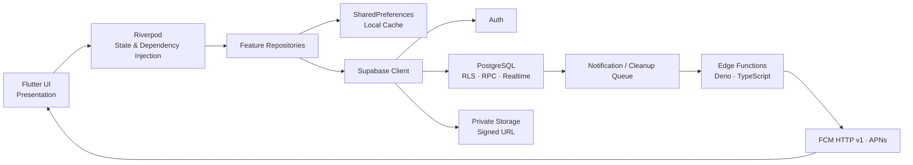

<p align="center">
  
</p>

<h1 align="center">Dear</h1>

<p align="center">
  두 사람이 대화, 추억, 기념일과 여행 기록을 함께 쌓는 커플 전용 Flutter 앱
</p>

<p align="center">
  
  
  
  
  
  
</p>

<p align="center">
  
</p>

## 프로젝트 소개

Dear는 커플의 대화와 사진, 기념일, 여행 기록이 여러 앱에 흩어지는
문제를 하나의 공유 공간으로 해결하기 위해 만든 개인 사이드 프로젝트입니다.
두 사용자가 4자리 초대 코드로 연결되면 실시간 채팅, 추억 앨범,
기념일 타임라인, 국내·세계 여행 지도와 오목 게임을 함께 이용할 수 있습니다.

Flutter로 Android/iOS 중심의 클라이언트를 구현했으며, Supabase를 주
백엔드로 사용합니다. 인증, PostgreSQL 데이터베이스, Realtime, 비공개
Storage, RPC와 Edge Functions를 Supabase에서 처리하고, Firebase Cloud
Messaging은 Android/iOS 푸시 전송에 사용합니다.

### 핵심 사용자 흐름

`회원가입·로그인 → 초대 코드로 1:1 연결 → 둘만의 공유 공간 이용 → 이벤트별 푸시·딥링크 수신`

## 주요 기능

| 기능 | 구현 내용 |
| --- | --- |
| 인증과 커플 연결 | 이메일 회원가입·로그인, 이메일 인증, 비밀번호 재설정, Apple OAuth, 24시간 유효한 4자리 초대 코드 기반 1:1 페어링 |
| 실시간 채팅 | 텍스트·사진 메시지, 다중 사진 업로드, 답장·복사·삭제, 하트 반응, 읽음 상태, 안 읽은 수, 상대 접속 상태, 검색과 미디어 모아보기 |
| 추억 앨범 | 앨범 CRUD, 대표 앨범·대표 사진, 다중 업로드와 실패 항목 재시도, 날짜·업로더 필터, 사진 이동·일괄 삭제, 커서 페이지네이션 |
| 기념일 | 커플 시작일 기반 100일·주년 자동 계산, 사용자 기념일 CRUD, D-day 타임라인, 반복·메모·연결 앨범·알림 시간 설정 |
| 여행 지도 | 공식 행정 경계 기반 국내 161개 여행 지역과 세계 지구본, 방문 지역 색칠, 방문일·메모·공유 사진, 검색·방문 필터·현재 위치 표시 |
| 실시간 오목 | 코드·푸시 초대, 수락·거절·만료 상태, 실시간 착수 동기화, 서버 판정, 30초 턴 제한, 기권·재대결·전적 |
| 알림과 데이터 관리 | 카테고리별 알림·무음 시간대, 앱 내 알림함, FCM/APNs 딥링크, 프로필 관리, JSON 데이터 내보내기, 연결 해제와 계정 삭제 |

## 기술 스택

| 영역 | 기술 | 이 프로젝트에서의 역할 |
| --- | --- | --- |
| Client | Flutter, Dart | Android/iOS 중심의 크로스 플랫폼 UI와 자체 디자인 시스템 구현 |
| State Management / DI | `flutter_riverpod` | `Provider`, `FutureProvider`, `StreamProvider`, `StateNotifierProvider`를 이용한 의존성 주입과 비동기·실시간 상태 관리 |
| Routing | `go_router` | 인증 상태 기반 redirect, 딥링크, 중첩 라우팅, `StatefulShellRoute.indexedStack` 기반 탭 상태 유지 |
| Backend | Supabase | Auth, PostgreSQL, Realtime, Storage, RPC, Edge Functions 제공 |
| Authentication | Supabase Auth | 이메일/비밀번호, 이메일 인증, 비밀번호 재설정, Apple OAuth와 세션 관리 |
| Database / Security | PostgreSQL, RLS, RPC | 커플 단위 데이터 격리, 원자적 페어링·게임 처리, 서버 권한 검증 |
| Push | Firebase Cloud Messaging | FCM HTTP v1 기반 Android/iOS 푸시, 토큰 갱신, 포그라운드·백그라운드 딥링크 |
| Background Jobs | Supabase Edge Functions, Deno/TypeScript, `pg_cron`, `pg_net`, Vault | 알림 작업 처리, 실패 재시도, 무효 토큰 정리, Storage 정리와 계정 삭제 |
| Local / Network | `shared_preferences`, `connectivity_plus` | 최근 채팅·읽음 커서 캐시와 연결 끊김 안내 |
| Maps / Location | `CustomPainter`, GeoJSON, `geolocator` | 지도 SDK 없이 국내 행정구역과 세계 지구본 렌더링, hit testing과 현재 위치 표시 |
| Media | `image_picker`, `gal`, `share_plus`, `http` | 이미지 선택·업로드·기기 저장·시스템 공유 |
| Testing | `flutter_test`, `flutter_lints` | 위젯, 라우팅, Repository, 동기화와 SQL migration 계약 검증 |

## 아키텍처

기능별로 코드를 나누고 각 기능 안에서 Presentation과 Data/Repository를
분리한 **feature-first repository architecture**를 사용합니다. Repository를
Riverpod Provider로 주입해 UI가 Supabase 및 플랫폼 API에 직접 의존하지
않도록 했고, 테스트에서는 각 의존성을 대체할 수 있게 구성했습니다.



## 핵심 기술적 구현

### 1. 데이터 증가를 고려한 bounded Realtime

채팅 전체 이력을 계속 구독하면 사용 기간에 비례해 메모리와 네트워크 사용량이
증가합니다. 따라서 최신 메시지 30개만 Realtime으로 구독하고, 이전 메시지는
ID cursor 기반으로 요청합니다. 추억 앨범과 기념일도 제한된 최신 구간과 cursor
page를 병합해 실시간성은 유지하면서 데이터 증가 비용을 제한했습니다.

### 2. 네트워크 장애를 고려한 채팅 동기화

최근 채팅 30개와 읽음 cursor를 사용자·커플별로 SharedPreferences에 저장합니다.
앱은 캐시를 먼저 표시한 뒤 서버 snapshot으로 갱신하며, 읽음 cursor는 로컬에
pending 상태로 기록하고 커플별 write를 순서대로 직렬화합니다. 원격 저장 실패
후에도 서버의 canonical cursor를 다시 확인해 중복 또는 역행 업데이트를 막습니다.

### 3. 클라이언트가 아닌 서버 중심의 권한 검증

모든 공유 데이터는 `couple_id`와 PostgreSQL RLS 정책으로 접근 범위를 제한합니다.
사진은 public URL 대신 private Storage와 만료되는 signed URL을 사용합니다.
커플 연결, 오목 착수와 승패 판정처럼 원자성과 권한 검증이 필요한 작업은
PostgreSQL RPC에서 처리합니다.

### 4. 재시도 가능한 푸시·정리 작업 파이프라인

메시지, 사진, 기념일과 게임 이벤트는 DB 작업 큐에 저장됩니다. `pg_cron`이
Edge Function worker를 호출하고, worker는 `FOR UPDATE SKIP LOCKED`로 작업을
claim한 뒤 FCM/APNs로 전송합니다. 사용자 알림 설정과 무음 시간대를 적용하고,
실패 재시도 및 무효 토큰 제거 상태를 기록합니다.

DB에서 삭제된 사진은 별도의 Storage cleanup queue로 전달됩니다. 일시적인
Storage 오류가 발생해도 bounded backoff로 재시도해 고아 파일이 남는 문제를
줄였습니다.

### 5. 지도 SDK 없이 구현한 여행 지도

국내 지도는 SGIS 행정구역 경계를 WGS 84로 재투영하고 1% 수준으로 단순화한
GeoJSON을 `CustomPainter`로 렌더링합니다. 252개 원본 경계를 앱의 161개 여행
지역에 빠짐없이 매핑하고, Web Mercator 투영과 영역 hit testing을 직접
구현했습니다. 세계 지도 역시 구면 투영과 회전·선택 로직을 자체 구현했습니다.

### 6. 세션과 딥링크를 함께 고려한 라우팅

`go_router`의 redirect에서 환경 설정, 인증 세션, 비밀번호 복구와 오류 상태를
구분합니다. 로그인 전에 받은 딥링크는 인증 완료 후 원래 목적지로 복귀시키며,
푸시 route는 허용된 내부 경로만 통과하도록 검증합니다. 메인 탭은
`StatefulShellRoute.indexedStack`으로 구성해 탭 전환 후에도 각 navigation
stack을 유지합니다.

## 프로젝트 구조

```text
lib/
├── main.dart                    # 앱 진입점
└── src/
    ├── app_bootstrap.dart       # Supabase, Firebase, Riverpod 초기화
    ├── app_router.dart          # 라우트, 인증 가드, 딥링크
    ├── common/                  # 디자인 시스템, 테마, 공통 오류·연결 UI
    ├── config/                  # dart-define 기반 환경 설정
    └── features/
        ├── auth/                # 인증, 프로필, 커플 연결
        ├── chat/                # 채팅과 추억 앨범
        ├── anniversary/         # 기념일과 타임라인
        ├── travel_map/          # 국내 여행 지도
        ├── world_map/           # 세계 여행 지도
        ├── mini_games/          # 실시간 오목
        ├── notifications/       # 푸시 등록과 알림함
        └── settings/            # 프로필 및 알림 설정

supabase/
├── migrations/                 # Schema, RLS, RPC, trigger, cron job
└── functions/                  # Push, Storage cleanup, account deletion worker

test/                            # Unit, widget, routing, repository, SQL contract tests
assets/                          # App images and map GeoJSON
scripts/                         # Android/iOS run and release helpers
```

## 로컬 실행

### 사전 준비

- Flutter SDK 및 Dart `>=3.4.3 <4.0.0`
- 기능을 실제로 사용하려면 별도의 Supabase 프로젝트
- 푸시 알림을 사용하려면 별도의 Firebase 프로젝트와 플랫폼 설정

### 1. 프로젝트 설치

```sh
git clone https://github.com/knemo0927-wq/dear-couple-app.git
cd dear-couple-app
flutter pub get
```

### 2. Supabase 클라이언트 설정

```sh
cp .env.example .env.local
```

`.env.local`에 클라이언트에서 공개되는 두 값을 입력합니다.

```dotenv
SUPABASE_URL=https://your-project-ref.supabase.co
SUPABASE_ANON_KEY=replace-with-your-public-anon-key
```

직접 `flutter run`을 실행할 때는 값을 Dart define으로 전달합니다.

```sh
set -a
source .env.local
set +a
flutter run \
  --dart-define=SUPABASE_URL="$SUPABASE_URL" \
  --dart-define=SUPABASE_ANON_KEY="$SUPABASE_ANON_KEY"
```

### 3. Firebase 설정 (선택)

푸시 알림이 필요한 플랫폼의 예제 파일을 복사하고 자신의 Firebase 프로젝트
값으로 교체합니다.

```sh
cp android/app/google-services.example.json android/app/google-services.json
cp ios/Runner/GoogleService-Info.example.plist ios/Runner/GoogleService-Info.plist
cp macos/Runner/GoogleService-Info.example.plist macos/Runner/GoogleService-Info.plist
```

실제 Firebase 설정 파일은 Git에서 제외됩니다. 데이터베이스 migration,
Edge Function과 서버 secret 설정은 [Supabase 배포 가이드](supabase/README.md)를
참고하세요.

## 테스트

```sh
flutter test
flutter analyze
```

테스트는 다음 범위를 다룹니다.

- 인증, 채팅, 앨범, 기념일, 지도와 오목의 widget interaction
- 인증 redirect, 딥링크와 StatefulShellRoute navigation
- cursor pagination, Realtime head 병합과 읽음 cursor 동기화
- 큰 글자, 긴 닉네임과 주요 화면 overflow 같은 접근성 회귀
- RLS, RPC, 작업 큐와 cleanup 동작을 고정하는 SQL migration contract

## 보안 설계와 공개 저장소 원칙

- `SUPABASE_ANON_KEY`는 클라이언트에 포함되는 공개용 키이므로 모든 데이터
  접근 권한은 RLS로 제한합니다.
- Supabase service-role key, Firebase service-account JSON/private key, 서명
  인증서와 운영 secret은 클라이언트 환경이나 저장소에 넣지 않습니다.
- 실제 Firebase 설정, 로컬 `.env`, Apple 계정 정보와 기기 ID는 Git에서
  제외하고 sanitized example만 제공합니다.
- 사용자 미디어는 private Storage에 보관하고 제한 시간 signed URL로 조회합니다.
- 이 프로젝트는 종단간 암호화를 제공한다고 주장하지 않습니다. 보안 경계는
  Supabase Auth, RLS, RPC와 Storage policy입니다.

## 데이터 출처

국내 지도는 국가데이터처의 SGIS 행정구역 통계 및 경계 데이터를 가공해
사용합니다. 기준일, 좌표계, 단순화 방식과 이용 조건은
[지도 데이터 출처 문서](assets/maps/README.md)에 기록했습니다.

## 프로젝트 상태와 라이선스

이 저장소는 구현 과정과 기술적 의사결정을 공유하기 위한 개인 포트폴리오
프로젝트입니다. Android/iOS를 중심으로 개발했으며, 실제 Apple 로그인과 푸시
알림은 각 플랫폼의 개발자 계정 및 별도 Supabase/Firebase 설정이 필요합니다.

별도의 `LICENSE`를 두지 않았습니다. 공개된 소스는 포트폴리오 열람 목적이며,
복제·배포·상업적 사용 권한을 별도로 부여하지 않습니다.
