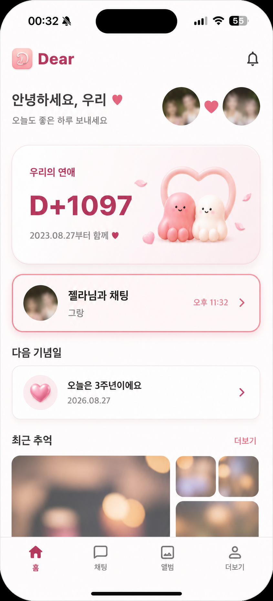
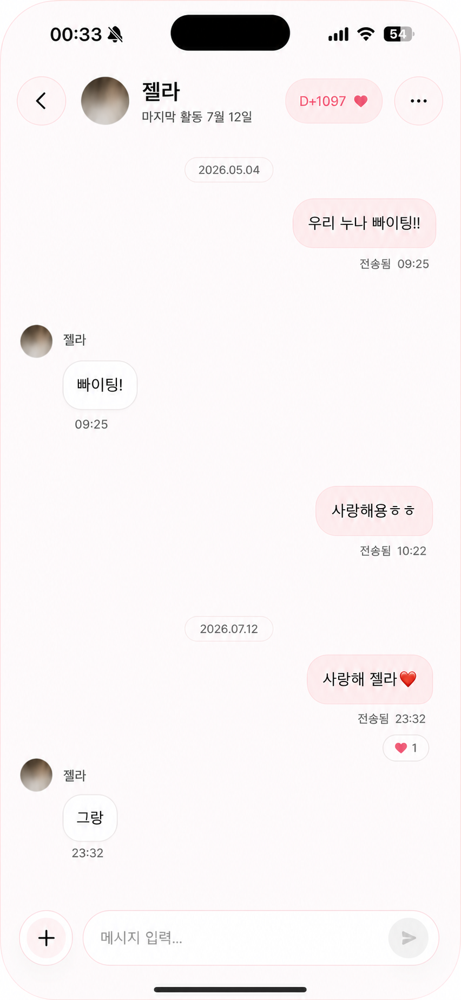

# Dear iOS UI/UX 감사 및 개선 제안

작성일: 2026-08-27  
대상: 아이폰 미러링에서 확인한 Dear 앱의 홈·채팅·검색·앨범·설정 핵심 흐름  
근거: 현재 실행 화면 16개 + Flutter 구현 코드 + 기존 `cherry-blossom-ui-reference.md` + `ui-ux-pro-max` 모바일 기준

## 한 줄 결론

Dear는 감성적인 브랜드와 기능 구조가 이미 좋다. 지금의 가장 큰 문제는 새 스타일이 아니라 **작은 글자와 낮은 대비, 모호한 아이콘, 네트워크 실패 시 콘텐츠 전체를 가리는 처리, 제스처 전용 기능, 화면별 토큰 드리프트**다. 이 다섯 가지를 먼저 고치면 디자인을 크게 갈아엎지 않아도 완성도가 눈에 띄게 높아진다.

## 감사 범위와 한계

- 실제 화면 확인: 홈, 1:1 채팅, 채팅 메뉴, 메시지 검색, 사진 모아보기, 앨범 목록/생성/상세/전체 사진/선택 모드, 사진 전체보기, 더보기, 위험 작업, 알림 설정 오류.
- 코드 확인: 인증·페어링, 다크모드, Dynamic Type, 알림 권한, 오목, 지도, 공통 테마와 라우팅.
- 이번에는 사용자의 지시에 따라 16개 화면에서 미러링 순회를 멈췄다. 기념일·지도·오목·로그인·온보딩은 실제 화면을 본 것으로 단정하지 않고 코드 근거로만 분리했다.
- VoiceOver, 최대 Dynamic Type, Reduce Motion, 가로모드, 다크모드는 실제 기기 설정으로 검증하지 않았다. 따라서 완전한 WCAG 준수 판정이 아니라 위험 식별과 수정 방향이다.
- 미러링 중 서버/미디어 요청 실패가 반복됐다. 원인이 테스트 네트워크인지 백엔드인지 이 감사만으로 단정할 수 없지만, 실패 시 콘텐츠와 통제권을 모두 잃는 UX는 원인과 무관하게 개선 대상이다.

## 유지해야 할 강점

1. `D+1097`과 두 마스코트가 제품의 감정적 중심을 즉시 만든다.
2. 홈 → 채팅/기념일/추억, 앨범 → 대표/최근/전체, 더보기 → 기능/계정/위험 작업의 정보 구조는 이해하기 쉽다.
3. 흰 카드, 옅은 로즈 배경, 코랄 포인트, 둥근 모서리의 기본 언어가 제품 성격과 맞는다.
4. 채팅 작성창, 하단 탭, 일부 지도 컨트롤은 이미 safe area와 충분한 크기를 고려했다.
5. loading/error/empty/retry 상태가 여러 기능에 구현돼 있어, 새로 만드는 것보다 상태 체계를 정리하는 편이 효율적이다.

## 우선순위별 핵심 개선안

### P1-1. 실패해도 기존 콘텐츠와 설정을 유지한다

현재 메시지 검색, 사진 모아보기, 알림 설정은 요청 하나가 실패하면 화면 전체가 오류 상태로 바뀐다. 앨범은 일부 사진만 실패해도 원인을 설명하지 않는 동일 placeholder만 남는다.

수정 방법:

- 마지막 성공 데이터와 로컬 설정값은 화면에 그대로 남긴다.
- 전체 화면 오류 대신 관련 섹션 상단에 `일부 사진을 불러오지 못했어요 · 다시 시도` 같은 inline banner를 둔다.
- 빈 상태, skeleton, 개별 이미지 실패, 전체 요청 실패를 각각 다른 컴포넌트로 만든다.
- 재시도 중에는 버튼을 비활성화하고 progress와 `다시 불러오는 중` 상태를 알린다.
- 검색어·필터·선택 상태는 실패 후에도 보존한다.
- 오류는 기술 용어 대신 `무엇이 실패했는지 + 사용자가 할 수 있는 일`로 쓴다.

완료 기준:

- 네트워크를 끊어도 이미 보던 앨범/설정이 사라지지 않는다.
- 부분 실패와 전체 실패가 시각·접근성 양쪽에서 구분된다.
- 오류 상태가 `Semantics(liveRegion: true)` 또는 적절한 native announcement로 한 번만 공지된다.

관련 구현: `chat_search_page.dart`, `chat_media_page.dart`, `memory_album_page.dart`, `notification_settings_page.dart`.

### P1-2. 작은 기능 텍스트와 컨트롤 경계 대비를 바로잡는다

측정 결과 흰색 배경 기준 현재 `coral #E85D8B`는 3.30:1, `disabled #9F8A94`는 3.21:1, `line #F2D6DF`는 1.36:1이다. 작은 일반 텍스트 4.5:1과 의미 있는 컨트롤 경계 3:1 기준에 부족하다. 반면 이미 존재하는 `coralText #B53260`은 5.85:1, `secondary #6F5963`은 6.39:1, `muted #8C6F7A`는 4.50:1이다.

수정 방법:

- `coral`은 큰 CTA 배경·장식에만 쓰고 작은 라벨/시간/배지는 `coralText`를 쓴다.
- placeholder와 보조 설명은 `secondary` 또는 최소 `muted`를 사용한다. disabled와 placeholder를 같은 토큰으로 쓰지 않는다.
- 입력·체크·선택 컨트롤 경계는 별도 `outlineStrong` 토큰을 둔다. 예시 `#C47E99`는 흰색과 3.09:1이다.
- 장식용 divider는 옅은 `line`을 유지할 수 있지만, 조작 가능한 경계에는 쓰지 않는다.
- 색만으로 선택/오류/읽지 않음을 전달하지 않고 아이콘·텍스트·상태명을 함께 쓴다.

관련 구현: `lib/src/common/dear_design.dart:5`, `lib/src/common/app_theme.dart:69`.

### P1-3. 모든 핵심 동작을 44pt와 명확한 이름으로 만든다

화면에서 종, 더보기, 뒤로가기, 선택 원, 반응 하트가 작게 보였다. 코드에서는 채팅 전송·이미지 열기와 여러 제스처가 의미 있는 접근성 이름 없이 구현돼 있고, 답장/복사/삭제는 long-press 중심이다.

수정 방법:

- iOS의 모든 탭 영역은 최소 44×44pt, 인접 타깃 간 간격은 최소 8pt로 한다.
- 시각 아이콘은 20–24pt여도 `SizedBox`/padding으로 hit area를 44pt 이상 확장한다.
- icon-only control에는 `Tooltip`과 `Semantics(label:, button: true)`를 둔다.
- decorative chevron은 `ExcludeSemantics`; 카드 전체만 하나의 버튼으로 읽는다.
- long-press는 보조 수단으로 남기고 `더보기` 또는 `customSemanticsActions`로 답장/복사/삭제 대체 경로를 제공한다.
- 하트 반응은 `toggled`, `count`를 함께 읽고 0개일 때는 칩 자체를 숨긴다.

관련 구현: `chat_page.dart:1425`, `chat_page.dart:1701`, `chat_page.dart:2280`, `anniversary_reminder_page.dart:1228`.

### P1-4. Dynamic Type에서 줄이지 말고 다시 배치한다

홈 히어로는 큰 글자에서 높이를 조금 늘린 뒤 `FittedBox(scaleDown)`으로 다시 글자를 줄인다. 기능 그리드와 알림 설정은 고정 3열/가로 Row/한 줄 ellipsis가 많아, 확대 사용자의 의도를 무효화할 가능성이 높다.

수정 방법:

- 핵심 제목·액션·오류는 축소나 한 줄 말줄임 대신 줄바꿈과 콘텐츠 기반 높이를 허용한다.
- 글자 배율이 커지면 홈 기능 카드 3열을 2열 또는 세로 목록으로 전환한다.
- 설정의 `아이콘 + 설명 + 버튼`, 무음시간 두 dropdown은 좁은 폭에서 `Column`/`Wrap`으로 바꾼다.
- 기준 타입 스케일을 `display D-day 48/56`, `title 24/32`, `titleSmall 18/24`, `body 16/24`, `bodySmall 14/20`, `label 13/18`로 토큰화한다.
- 최소 375pt 폭, 320pt급 작은 폰, 최대 접근성 글자, 가로모드에서 각각 확인한다.

관련 구현: `chat_list_page.dart:533`, `chat_list_page.dart:1381`, `notification_settings_page.dart:255`.

### P1-5. 인증과 페어링 입력을 지속 라벨 기반으로 바꾼다

코드 기준 로그인 이메일·비밀번호는 placeholder만 라벨로 사용한다. 4자리 페어링 입력은 보이는 박스와 투명한 실제 `TextField`가 분리돼 접근성 이름·현재 자릿수 안내가 없다.

수정 방법:

- `labelText: '이메일'`, `labelText: '비밀번호'`를 항상 보이게 하고 placeholder는 예시로만 사용한다.
- 검증은 입력 중 매 키마다가 아니라 blur 또는 제출 시점에 수행한다.
- 제출 실패 시 첫 오류 필드로 포커스를 옮기고 상단 오류 요약과 인라인 오류를 함께 유지한다.
- 페어링 입력 전체를 `Semantics(textField: true, label: '페어링 코드 4자리', value: '2자리 입력됨')`로 묶고 시각용 문자는 semantics에서 제외한다.
- 붙여넣기, 자동 대문자, 비밀번호 관리자와 autofill을 막지 않는다.

관련 구현: `auth_gate.dart:262`, `auth_gate.dart:1100`.

### P1-6. 알림 권한을 사용자가 이유를 이해한 뒤 요청한다

현재 코드는 로그인 세션 동기화 시 `requestPermission()`을 바로 호출하고, iOS APNs 최대 60초 + FCM 최대 30초를 폴링한다. 사용자는 왜 권한이 필요한지 모른 채 iOS의 1회성 프롬프트를 소진할 수 있다.

수정 방법:

- 자동 토큰 동기화와 시스템 권한 요청을 분리한다.
- `둘만의 메시지와 기념일을 놓치지 않도록 알림을 켤까요?`라는 사전 설명 화면에서 사용자가 `알림 켜기`를 누를 때만 시스템 프롬프트를 띄운다.
- denied는 즉시 `설정 열기`, provisional/authorized는 짧은 토큰 등록 단계로 분기한다.
- FCM/APNs 세부 칩은 일반 설정 화면이 아니라 진단 상세에 둔다.
- 긴 폴링 중에는 남은 단계와 취소/나중에 하기 경로를 제공한다.

관련 구현: `push_registration_providers.dart:19`, `push_registration_providers.dart:103`.

### P1-7. 다크모드는 켜기 전에 토큰부터 완성한다

현재 `darkTheme`에 다시 light theme을 전달하고 `ThemeMode.light`로 고정한다. 실제 `AppTheme.dark()`도 일부 색과 AppBar만 정의돼 있어 단순히 system mode로 바꾸면 화면 곳곳이 밝게 남는다.

수정 방법:

- 먼저 화면의 raw `Colors.white`/고정 hex를 `ColorScheme` 또는 `ThemeExtension`의 `surface`, `onSurface`, `muted`, `border`, `accent`, `danger`로 옮긴다.
- dark theme에 scaffold, input, card, button, sheet, dialog, system overlay, divider, disabled/pressed/focus 상태를 모두 정의한다.
- 이후 `darkTheme: AppTheme.dark()`, `themeMode: ThemeMode.system`으로 전환한다.
- 모달 scrim과 사진 위 badge는 실제 합성 배경에서 다시 대비를 측정한다.
- 특정 Dear용 dark palette는 `ui-ux-pro-max` 검색에서 제품 적합도가 확인되지 않아 임의 팔레트를 채택하지 않았다. 이 항목은 스킬의 모바일 기본 규칙과 실제 토큰 대비 측정을 근거로 한다.

관련 구현: `app_root.dart:266`, `app_theme.dart:145`.

### P1-8. 오목은 VoiceOver 사용자가 실제로 돌을 둘 수 있어야 한다

이 항목은 화면 미확인·코드 근거다. 15×15 판의 hit size는 일반 iPhone에서 약 30–33pt이고, 판 전체 `Semantics(excludeSemantics: true)` 때문에 각 교차점을 VoiceOver로 선택할 수 없다.

수정 방법:

- 시각 판에는 확대/팬과 `교차점 탭 → 좌표 미리보기 → 돌 놓기 확인` 흐름을 제공한다.
- 접근성 대안으로 행/열 선택기와 `돌 놓기` 버튼을 제공하거나, 합법 교차점에 의미 있는 semantic action을 생성한다.
- 라벨 예: `8행 8열, 빈 칸, 현재 선택`, 마지막 수와 흑/백 돌 상태를 함께 공지한다.
- 게임 본문 전체를 bottom safe area로 감싼다.

관련 구현: `omok_game_page.dart:475`.

## P2 개선안

### 화면 전환과 Reduce Motion

공통 fade-slide 전환이 260/220ms로 고정되고 사용자의 Reduce Motion을 확인하지 않는다. iOS 기본 route 전환과 edge-back도 약해질 수 있다. 기본/adaptive route를 우선하고, 브랜드 전환이 꼭 필요할 때 `MediaQuery.disableAnimations`에서 duration을 0으로 만들며 애니메이션을 언제든 중단 가능하게 한다.

관련 구현: `app_router.dart:250`.

### 사진 전체보기

검은 배경에서 제목 대비가 거의 없고 사진 위치, 재시도, 접근성 설명이 부족하다. 흰색 헤더, `1 / 6`, swipe/zoom 안내, 실패 시 `다시 시도`, 실패 중 저장/공유 비활성화를 적용한다.

### 앨범 생성 시트

`대표 사진 선택`, `사진 선택`, `선택 취소`, X가 중복된다. `앨범 이름 → 표지 사진(선택) → 만들기`로 줄이고 취소 경로는 하나만 둔다. 표지를 선택하지 않아도 생성 가능하게 하고 생성된 기본 커버를 사용한다.

### 위험 작업

`내 데이터 다운로드`, `로그아웃`, `커플 연결 해제`, `계정 삭제`를 분리한다. 연결 해제/삭제에는 결과와 복구 가능 여부, 영향 받는 공유 데이터, 재인증/타이핑 확인을 명시한다. 색 외에도 섹션 제목과 경고 아이콘으로 의미를 반복한다.

### 지도와 캔버스 접근성

이 항목은 화면 미확인·코드 근거다. 국내/세계 지도 overlay에 가로·하단 safe area와 breakpoint 배치를 적용한다. 지도 캔버스가 시각 탐색용임을 알리고 `장소 목록 열기`를 항상 접근 가능한 대체 경로로 제공한다.

## 디자인 시스템 수정안

### 색

| 역할 | 권장값/사용법 |
| --- | --- |
| Brand accent | `#E85D8B`, 큰 CTA 배경·장식만 |
| Functional coral text | `#B53260`, 작은 라벨·badge·link |
| Primary text | `#2D1F25` |
| Secondary text | `#6F5963` |
| Muted readable text | `#8C6F7A`, 흰색에서 4.50:1 |
| Decorative line | `#F2D6DF`, 정보/상태를 전달하지 않는 divider만 |
| Strong control outline | 예시 `#C47E99`, 흰색에서 3.09:1 |
| Error | `#D64545`, 아이콘·문구와 함께 |

### 모서리와 간격

- 코드의 현재 8/12/16 radius와 문서의 14/18/22/30 기준이 충돌한다. `chip 14`, `input/button 18`, `card 22`, `sheet/hero 30`, `pill 999`로 하나의 소스에 통합한다.
- 4/8 기반 spacing token을 `4, 8, 12, 16, 20, 24, 32`로 고정한다.
- 기본 좌우 gutter 20pt, compact 16pt, tablet/landscape는 더 넓게 조정한다.
- 카드 그림자는 한 종류의 매우 부드러운 shadow만 사용하고 선택/포커스는 그림자가 아니라 명확한 border/state layer로 표현한다.

### 아이콘과 이미지

- bell, plus, more, chevron, 검색, 오류 아이콘은 ImageGen 대상이 아니다. Material/Cupertino/SVG 한 계열로 교체하고 동일 stroke/size token을 쓴다.
- `anniv_more_dots.png`, `anniv_chevron_right.png`, `anniv_add_plus.png`, `anniv_bell.png` 같은 작은 raster control glyph는 벡터로 교체한다.
- 34px 로고에 1024px PNG, 44px 홈 아이콘에 512px PNG를 그대로 decode하지 말고 `cacheWidth/cacheHeight` 또는 실제 2x/3x variant를 제공한다.
- 사용자 사진이 있는 곳에서는 마스코트가 사진을 밀어내지 않게 한다. 마스코트는 hero·온보딩·빈 상태에만 쓴다.

## 화면별 건강도 요약

| Step | 화면/상태 | 건강도 | 가장 먼저 고칠 것 |
| --- | --- | --- | --- |
| 01 | 홈 | 개선 필요 | 채팅을 명확한 다음 행동으로, 보조 텍스트 대비/크기 강화 |
| 02 | 1:1 채팅 | 개선 필요 | 헤더 단순화, 첨부 버튼 통합, 반응/메타 재배치 |
| 03 | 채팅 더보기 | 개선 필요 | 비활성 이유, 44pt 행, modal focus/닫기 |
| 04 | 검색 초기 | 보통 | 검색 범위 설명, 표준 검색바, placeholder 대비 |
| 05 | 검색 오류 | 취약 | 입력 유지, 기능별 오류 문구, inline 복구 |
| 06 | 사진 모아보기 오류 | 취약 | 캐시 유지, 사진 맥락에 맞는 오류와 재시도 |
| 07 | 앨범 목록 | 취약 | loading/empty/error 구분, 카드 탭 영역 단순화 |
| 08 | 새 앨범 시트 | 개선 필요 | 표지 선택 중복 제거, 취소 경로 통합 |
| 09 | 앨범 상세 | 보통 | 사진 수/정렬 맥락, long-press 대체 경로 |
| 10 | 사진 전체보기 | 취약 | 헤더 대비, 위치 표시, 실패 재시도/버튼 상태 |
| 11 | 앨범 부분 실패 | 취약 | 기존 콘텐츠 유지 + 섹션 inline banner |
| 12 | 전체 사진 | 취약 | 사진 실패 복구, 결과 수, 필터 상태 강화 |
| 13 | 선택 모드 | 개선 필요 | 명시적 취소, 44pt 선택 타깃, 상태 semantics |
| 14 | 더보기 상단 | 보통 | 아바타/아이콘 체계 통일, 설명 대비 강화 |
| 15 | 계정·위험 작업 | 개선 필요 | 위험 작업 간격/경고/결과 설명 강화 |
| 16 | 알림 설정 오류 | 취약 | 로컬 설정 유지, 권한 상태와 설정 열기 제공 |

상세 화면별 증거와 설명은 [screen-by-screen-audit.md](screen-by-screen-audit.md)에 있다.

## 생성한 디자인 시안

### 홈 개선 방향

- D-day hero는 유지하되 그 다음 행동인 채팅 카드에 선명한 border와 더 큰 메타를 부여했다.
- 보조 텍스트를 어둡게 하고, 16–20pt gutter와 44pt control 기준을 시각화했다.
- 실제 사진은 개인정보 보호를 위해 흐린 placeholder로 바꾼 디자인 방향 시안이다.

### 채팅 개선 방향

- 헤더를 뒤로가기/상대 정보/관계일수/더보기로 명확하게 묶었다.
- 0개 반응은 숨기고 실제 반응 1개만 말풍선 아래에 붙였다.
- 두 미디어 아이콘을 하나의 `+` 첨부 메뉴로 통합하고 입력/전송 타깃을 키웠다.

### 앨범 기본 커버·빈 상태 자산

- 표지를 선택하지 않은 새 앨범, 첫 사진이 없는 앨범, 온보딩/빈 상태에서 재사용할 수 있다.
- 단순 아이콘보다 Dear의 정체성을 살리되 실제 사진이 생기면 즉시 교체해야 한다.
- 3:2 카드에 맞는 시안이며, 실제 적용 전 기기별 crop과 text overlay 없는 상태를 확인한다.

UI 시안은 구현 규격을 설명하기 위한 방향안이며 픽셀 단위 최종 소스가 아니다. 실제 Flutter 화면에서는 토큰·Dynamic Type·상태 semantics를 코드로 구현해야 한다.

## 구현 순서

### 묶음 A — 바로 체감되는 공통 기반

1. 색/타입/spacing/radius/icon/touch/motion 토큰 정리.
2. 작은 coral/gray 텍스트와 input outline 대비 수정.
3. 공통 `DearAsyncSection`을 만들어 content-preserving error banner, retry busy, empty, skeleton을 통일.
4. 공통 icon button에 44pt, tooltip, semantics 적용.

### 묶음 B — 실제 확인한 핵심 화면

1. 홈의 우선순위·최근 추억 bottom inset·Dynamic Type 재배치.
2. 채팅 헤더/첨부/전송/반응/long-press 대체 액션.
3. 앨범 이미지 부분 실패, 생성 시트, 사진 선택 모드, 전체보기 복구.
4. 더보기 위험 작업과 알림 설정의 degraded mode.

### 묶음 C — 코드에서 발견한 시스템 문제

1. 인증 persistent labels와 페어링 semantics.
2. 알림 권한 사전 설명과 폴링 구조 분리.
3. 다크 테마 토큰 완성 후 system mode 적용.
4. 오목판 접근 가능한 착수 대안.
5. Reduce Motion과 native back gesture.

## 검증 체크리스트

- 375pt, 작은 iPhone, 큰 iPhone, 가로모드에서 overflow/가림 없음.
- 최대 Dynamic Type에서도 핵심 제목·액션·오류가 축소·말줄임되지 않음.
- VoiceOver 읽기 순서가 시각 순서와 같고 icon control 이름/상태가 명확함.
- 모든 핵심 타깃 44×44pt 이상, 인접 타깃 8pt 이상.
- light/dark 각각 일반 텍스트 4.5:1, meaningful control boundary 3:1.
- Reduce Motion에서 불필요한 transition/heart animation이 즉시 상태 변경으로 대체됨.
- 네트워크 끊김 시 마지막 성공 콘텐츠와 입력/필터/선택 상태가 유지됨.
- 이미지 개별 실패, 전체 실패, 데이터 없음, 로딩이 서로 다른 상태로 표현됨.
- 알림 거절 후 `설정 열기`로 복구 가능하고, 권한 요청 전 이유를 설명함.
- 파괴적 작업은 결과와 복구 가능 여부를 명시하고 confirm 후 실행됨.

## 적용한 UI/UX 기준

- `ui-ux-pro-max`: iOS 44pt, 8pt 간격, 일반 텍스트 4.5:1, control boundary 3:1, visible labels, error recovery/live announcement, Dynamic Type, Reduce Motion, safe area, predictable back navigation.
- Flutter stack 검색: `GestureDetector` 단독 사용보다 `Semantics`를 함께 사용하고 정적 widget은 const로 유지하는 권고를 확인했다.
- Dear 전용 다크 팔레트와 Dynamic Type 세부 검색은 상위 결과가 제품 맥락과 맞지 않아 채택하지 않았다. 해당 권고는 검색 결과를 꾸미지 않고 스킬의 canonical mobile defaults, `pro-rules.md`, 실제 코드/대비 측정으로 보완했다.

