# Dear iOS UI/UX 화면별 감사

> 2026-08-27 아이폰 미러링에서 직접 확인하고 저장한 화면만 시각 근거로 사용했다. 접근성 구현 세부는 별도 코드 감사로 보완했으며, 스크린샷만으로 완전한 WCAG 준수를 주장하지 않는다.

## Step 01 — 홈

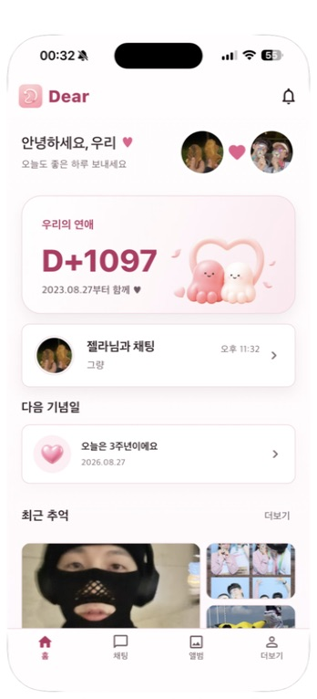

- 상태: 전반적으로 안정적이지만 핵심 행동의 위계와 하단 콘텐츠 가시성은 개선 필요.
- 장점: 브랜드 색·둥근 카드·커플 캐릭터가 한 화면에서 일관되고, `D+1097`이 관계의 감정적 중심을 잘 만든다. 홈에서 채팅·기념일·최근 추억으로 이어지는 정보 구조도 이해하기 쉽다.
- UX 위험: 가장 중요한 다음 행동이 `채팅 카드`, `다음 기념일`, `최근 추억` 사이에서 비슷한 시각 무게를 가져 첫 탭 결정이 느리다. 최근 추억 섹션은 초기 화면에서 이미지 일부만 보이며 하단 탭바와 가까워 스크롤 가능성 및 카드의 탭 영역이 불명확하다.
- 접근성 위험(화면 근거): 보조 설명·시간·하단 탭 라벨이 매우 작고 연한 회색이라 작은 글자 대비와 Dynamic Type 확대 시 재배치가 필요해 보인다. 종 아이콘과 카드 화살표는 시각 크기가 작아 44pt 이상의 실제 히트 영역 및 접근성 이름을 코드에서 확인해야 한다.
- 제안 초안: 홈의 우선순위를 `현재 관계 상태 → 이어서 할 일 1개 → 예정/추억`으로 명확히 하고, 보조 텍스트는 최소 13–14pt/충분한 대비, 카드 전체를 하나의 명확한 탭 타깃으로 제공한다. 스크롤 콘텐츠에는 탭바 높이+safe area만큼 하단 인셋을 보장한다.
- 증거: `screenshots/01-home.png`.

## Step 02 — 1:1 채팅

- 상태: 핵심 기능은 단순하고 친근하지만 읽기·작성·탐색의 기본 명료성이 부족하다.
- 장점: 발신/수신 말풍선 위치와 옅은 분홍 포인트가 구분되고, 날짜 구분선과 전달 상태가 존재한다. 입력창을 safe area 위에 고정한 구성도 적절하다.
- UX 위험: 상단의 뒤로가기, 상대 프로필, 관계일수, 더보기 아이콘이 한 줄에 밀집해 각각의 역할 위계가 약하다. `마지막 활동 7/12`는 날짜 형식이 모호하며 오래된 상태인지 즉시 이해하기 어렵다. 하단에는 이미지 관련 아이콘이 두 개 연속 배치되어 차이가 불분명하고, 비활성처럼 보이는 전송 버튼이 왜 비활성인지 설명이 없다. 메시지별 하트가 작은 외곽선으로 흩어져 있어 반응 여부·개수를 읽기 어렵다.
- 접근성 위험(화면 근거): 전달 시간, 전달 상태, 상대 이름 보조표시, 입력 placeholder가 작고 대비가 낮다. 아이콘 버튼은 시각 크기가 약 20–24pt로 보여 44pt 히트 영역과 접근성 이름을 검증해야 한다. 발신/수신 구분이 위치·옅은 색에 크게 의존한다.
- 제안 초안: 헤더를 `뒤로가기 / 상대 정보 / 통화·더보기` 구조로 단순화하고 관계일수는 상대 정보 화면으로 옮기거나 보조 칩으로 낮춘다. 미디어 첨부는 하나의 `+` 메뉴로 통합하고 입력/전송 상태를 명확히 한다. 메타 텍스트를 12–13pt 이상과 높은 대비로 조정하고 반응은 말풍선 아래 한 덩어리로 묶는다.
- 증거: `screenshots/02-chat.png`.

## Step 03 — 채팅 더보기 메뉴

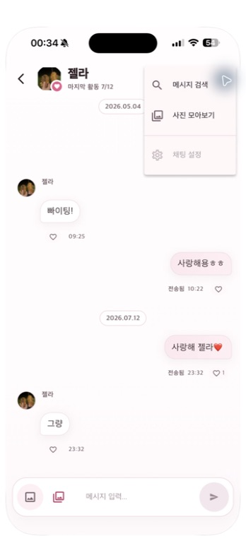

- 상태: 기능 수는 적절하지만 메뉴 배치·활성 상태 전달이 불완전하다.
- 장점: 검색, 사진 모아보기, 채팅 설정을 사용 빈도 순으로 세로 정렬해 훑기 쉽다.
- UX 위험: 팝오버가 화면 오른쪽 가장자리에 매우 가깝고 헤더/콘텐츠 위를 넓게 가려, 어떤 버튼에서 열린 메뉴인지 연결감이 약하다. `채팅 설정`은 회색이라 비활성처럼 보이지만 이유나 조건이 없다. 바깥 영역 탭으로 닫을 수 있다는 단서도 없다.
- 접근성 위험(화면 근거): 메뉴 행 높이가 44pt에 가까워 보이나 글자·아이콘 대비가 약하다. 팝오버가 열릴 때 초점 이동, ESC/뒤로 닫기, 모달 상태 안내는 화면만으로 확인할 수 없다.
- 제안 초안: iOS에서는 `Menu`/bottom sheet 중 하나로 플랫폼 관례에 맞추고, 각 행을 최소 44pt로 한다. 사용할 수 없는 항목은 숨기거나 `준비 중` 설명을 붙인다. 메뉴 오픈 시 배경 스크림과 명확한 앵커/선택 피드백을 제공한다.
- 증거: `screenshots/03-chat-more-menu.png`.

## Step 04 — 메시지 검색 초기/빈 상태

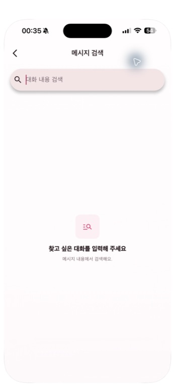

- 상태: 목적은 분명하지만 검색 전 상태가 화면 대부분을 비워 둔다.
- 장점: 상단 제목, 검색 입력, 안내 문구가 단순해 사용자가 해야 할 일을 이해할 수 있다. 검색어 지우기 동작도 입력 후 제공된다.
- UX 위험: 검색 필드가 화면 너비에 비해 높고 강한 분홍 배경·그림자를 가져 전체 위계가 무겁다. 반대로 중앙 안내 아이콘과 보조 문구는 너무 작고 약하다. 검색 범위(현재 대화 전체인지, 첨부/날짜 포함인지), 최소 글자 수, 최근 검색 등 유용한 단서가 없다.
- 접근성 위험(화면 근거): placeholder와 보조 문구 대비가 낮다. 입력 포커스·지우기 버튼의 접근성 이름, 키보드의 Search 액션, 검색 결과 개수 안내는 동작 테스트가 필요하다.
- 제안 초안: iOS 검색 바 높이와 표준 색 토큰으로 낮추고, 초기 상태에는 `상대방과의 대화에서 키워드를 찾아보세요`처럼 범위를 명시한다. 최근 검색은 실제 가치가 있을 때만 3–5개 이내로 제공한다.
- 증거: `screenshots/04-message-search-empty.png`.

## Step 05 — 메시지 검색 오류 상태

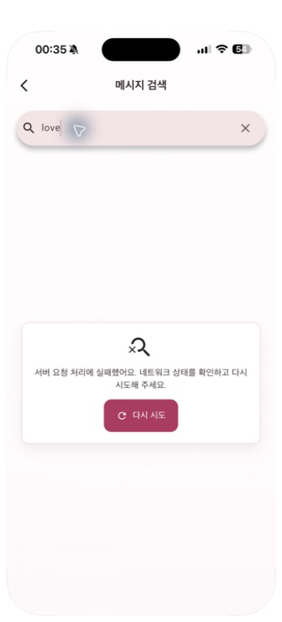

- 상태: 복구 버튼은 있으나 오류의 원인·복구 경로가 모호하다.
- 장점: 오류를 화면 중앙 카드에 모으고 `다시 시도`를 제공해 사용자가 막힌 상태를 인식할 수 있다.
- UX 위험: `서버 요청 처리에 실패했어요`는 사용자가 해결할 수 없는 기술 표현이며, `네트워크 상태를 확인`하라는 문구는 실제 서버 오류와 충돌할 수 있다. 재시도 버튼 외에 이전 메시지/오프라인 캐시 검색 같은 대안이 없다. 오류 카드가 화면 중간에 갑자기 떠 있어 검색 입력과의 인과관계가 약하다.
- 접근성 위험(화면 근거): 오류 아이콘만으로 의미를 보강하지 못하고, 상태가 스크린리더에 즉시 공지되는지 확인할 수 없다. 오류 텍스트와 버튼을 한 그룹으로 읽도록 구성해야 한다.
- 제안 초안: `검색 결과를 불러오지 못했어요. 연결을 확인한 뒤 다시 시도해 주세요.`처럼 사용자 언어로 통일하고, 입력은 유지한다. 자동 재시도/오프라인 검색 가능 여부를 명확히 하며 오류 발생 시 live region 또는 native announcement를 사용한다.
- 증거: `screenshots/05-message-search-error.png`.

## Step 06 — 채팅 사진 모아보기 오류

- 상태: 복구 가능하지만 화면 밀도와 문구가 검색 오류와 거의 동일해 기능 맥락이 사라진다.
- 장점: 뒤로가기와 제목, 재시도 동작이 단순하다.
- UX 위험: 사진 화면인데 오류 카드의 작은 일반 이미지 아이콘 외에는 사진 컬렉션 맥락이 없다. 넓은 화면 대부분이 비어 있고, 실패 원인이 같은 기술 문구로만 표현된다.
- 접근성 위험(화면 근거): 오류 상태가 발생했을 때 자동 공지 여부, 재시도 중 busy 상태와 중복 탭 차단 여부를 확인할 수 없다.
- 제안 초안: `사진을 불러오지 못했어요`처럼 기능별 문구를 쓰고, 캐시된 썸네일이 있으면 유지한 채 상단 inline banner로 실패를 알린다. 전체 실패라면 최근 성공 시각과 재시도 상태를 표시한다.
- 증거: `screenshots/06-chat-media-error.png`.

## Step 07 — 추억 앨범 목록

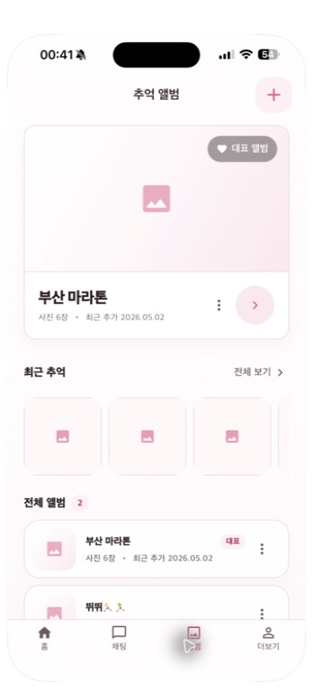

- 상태: 정보 구조는 좋지만 사진 로딩 실패가 화면의 대부분을 비워 보이게 만든다.
- 장점: 대표 앨범, 최근 추억, 전체 앨범 순서가 사용 맥락에 맞고, 상단 `+`로 생성 진입이 분명하다. 카드의 제목·사진 수·최근 추가일도 유용하다.
- UX 위험: 대표 앨범 커버와 최근 사진 3장이 모두 동일한 분홍 placeholder로 보여 실제 오류인지 로딩인지, 원래 사진이 없는지 구분되지 않는다. 대표 앨범 카드의 큰 원형 화살표, 더보기, 카드 전체가 서로 다른 탭 영역처럼 보여 동작 경계가 모호하다. `전체 앨범 2`의 숫자 2는 작고 색만 달라 의미가 약하다.
- 접근성 위험(화면 근거): plus·ellipsis·chevron 아이콘이 작고 텍스트 라벨이 없다. 대표/사진 수 상태가 색·작은 배지에 의존한다. 썸네일 실패의 대체 텍스트 여부는 확인이 필요하다.
- 제안 초안: 썸네일은 skeleton→성공/실패/빈 커버를 서로 다른 상태로 만들고, 실패에는 카드별 재시도 또는 공통 배너를 제공한다. 앨범 카드는 전체 탭 한 개로 단순화하고 더보기만 독립 버튼으로 둔다. `대표 앨범`은 제목 옆 고정 배지로, 앨범 수는 섹션 제목 텍스트에 자연스럽게 포함한다.
- 증거: `screenshots/07-memory-album.png`.

## Step 08 — 새 앨범 만들기 시트

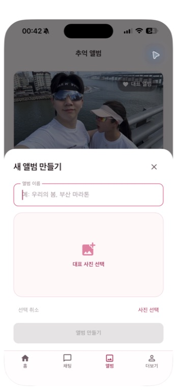

- 상태: 필요한 입력은 적지만 표지 선택과 사진 선택의 개념이 중복되고, 시트 뒤 탭바가 남아 집중도가 떨어진다.
- 장점: 앨범 이름과 대표 사진만 요구해 생성 절차가 짧다. 생성 불가 상태를 비활성 버튼으로 미리 보여 준다.
- UX 위험: 큰 `대표 사진 선택` 영역 아래에 다시 `사진 선택` 텍스트 액션이 있어 두 기능이 같은지 다른지 알기 어렵다. 왼쪽 `선택 취소`는 사진 선택 취소인지 시트 취소인지 불분명하며, 상단에도 닫기 X가 있어 취소 경로가 중복된다. 하단 탭바가 스크림 아래 보이면서 modal 집중을 방해한다.
- 접근성 위험(화면 근거): floating label과 placeholder 대비가 낮고, 비활성 `앨범 만들기`의 상태 이유가 설명되지 않는다. 시트가 열릴 때 제목 또는 첫 입력으로 초점 이동, 닫은 뒤 원래 `+`로 초점 복귀가 필요하다.
- 제안 초안: `앨범 이름` → `표지 사진(선택 사항)` → `앨범 만들기`의 세 단계로 단순화한다. 표지 영역 한 곳에서만 선택/변경/삭제하고, 시트 취소는 X 또는 `취소` 하나만 둔다. 표지가 필수가 아니라면 이름만 입력해도 생성 가능하게 하고 기본 커버를 제공한다.
- 증거: `screenshots/08-create-album-sheet.png`.

## Step 09 — 앨범 상세

- 상태: 사진 감상에는 깔끔하지만 관리·맥락 기능의 발견성이 낮다.
- 장점: 3열 정사각형 그리드가 사진을 주인공으로 만들고, 여백·모서리 반경이 일관된다. 상단 제목과 사진 추가 버튼도 단순하다.
- UX 위험: 촬영일·추가일·업로더·사진 수가 전혀 보이지 않아 추억의 시간 맥락과 정렬 기준을 알 수 없다. 대표 사진 배지는 사진 위에 작게 겹쳐 읽기 어렵고, 길게 눌러 대표 지정하는 기능은 화면에서 발견할 방법이 없다. 사진 선택/관리 모드 진입도 없다.
- 접근성 위험(화면 근거): 사진에 보이는 대체 설명·인덱스가 없고, 대표 배지가 색과 작은 텍스트에 의존한다. 각 썸네일 100pt 정도로 탭 크기는 충분하지만 의미 있는 접근성 라벨이 필요하다.
- 제안 초안: 제목 아래에 `사진 6장 · 최근 추가 2026.05.02` 메타를 두고, 우상단 `···`에 정렬/선택/앨범 편집을 모은다. 대표 표시는 선명한 아이콘+텍스트 또는 접근성 상태로 통일하고, long-press 전용 기능에는 `선택` 모드/더보기 대체 경로를 제공한다.
- 관찰 메모: 생성 시트의 X를 탭한 직후 이 화면으로 전환되어 시트 닫기 탭이 아래 카드로 전달됐을 가능성이 있다. 재현 테스트 후 실제 tap-through라면 modal barrier에서 포인터 이벤트를 소비해야 한다.
- 증거: `screenshots/09-album-detail.png`.

## Step 10 — 사진 전체보기

- 상태: 사진 몰입감은 좋지만 헤더 대비와 탐색·오류 복구가 취약하다.
- 장점: 검은 배경이 사진에 집중시키고, 저장/공유 액션을 하단 safe area 위에 배치했다. 버튼 라벨도 아이콘만 쓰지 않아 이해하기 쉽다.
- UX 위험: 상단 `이미지 보기` 제목이 검정 배경에서 거의 보이지 않는다. 여러 사진 중 현재 위치(예: 1/6), 촬영/추가 정보, 스와이프 가능 단서가 없다. 저장/공유가 이미지 로드 실패 후에도 남는 구현은 사용자에게 실패를 반복시킬 수 있다.
- 접근성 위험(화면 근거): 이미지 대체 설명과 `사진 1/6` 상태가 보이지 않는다. pinch zoom·swipe에 대응하는 접근 가능한 버튼/설명이 필요하며, 로딩 spinner와 오류는 live-region/재시도 경로가 코드상 부족하다.
- 제안 초안: 제목/아이콘을 흰색 또는 충분한 대비로 바꾸고 중앙에 `1 / 6`을 표시한다. 탭으로 chrome 숨김/표시, 좌우 스와이프, 확대 상태를 명확히 하며 실패 시 `다시 시도`와 닫기만 남기고 저장/공유를 비활성화한다.
- 증거: `screenshots/10-photo-viewer.png`.

## Step 11 — 앨범 목록 로드 완료/부분 실패

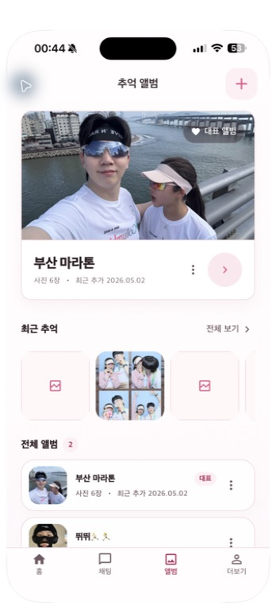

- 상태: 대표 커버는 로드되지만 최근 추억 일부가 계속 실패해 부분 실패 처리가 필요하다.
- 관찰: 같은 화면에서 대표 커버와 일부 사진은 정상 표시됐지만 최근 추억 3장 중 2장은 오류 glyph만 남았다. 앱은 이를 사용자에게 설명하거나 개별 재시도하지 않는다.
- 제안 초안: 썸네일별 실패를 조용히 숨기지 말고 전체 사진 데이터는 유지하면서 `일부 사진을 불러오지 못했어요 · 다시 시도`를 섹션 상단에 표시한다. 자동 재시도는 제한하고, CDN URL/캐시 만료 문제는 백그라운드에서 갱신한다.
- 증거: `screenshots/11-memory-album-loaded.png`.

## Step 12 — 전체 사진

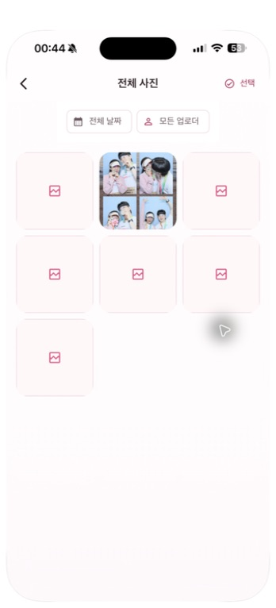

- 상태: 필터와 선택 기능은 잘 노출되지만 사진 실패가 화면을 무의미하게 만든다.
- 장점: 날짜·업로더 필터를 상단에 고정하고, 우상단 선택 모드를 분리한 정보 구조가 명확하다. 그리드 타깃도 충분히 크다.
- UX 위험: 7개 중 6개가 동일한 오류 placeholder인데 오류/로딩/빈 값의 차이가 없고 재시도도 없다. 사진 수·적용 중인 필터 결과 수가 표시되지 않는다. 필터 칩의 낮은 대비와 작고 옅은 텍스트 때문에 상태 인식이 약하다.
- 접근성 위험(화면 근거): placeholder에는 사진의 의미·날짜·업로더 대체 정보가 없다. `선택`의 체크 아이콘은 비선택 상태와 진입 액션이 혼동될 수 있다.
- 제안 초안: 제목 아래 `7장의 사진`을 표시하고, 필터 칩은 선택 여부가 색+아이콘+텍스트로 드러나게 한다. 썸네일 실패 시 대체 설명과 개별/전체 재시도, 선택 모드에서는 상단 bar를 `취소 · N개 선택 · 전체선택`으로 바꾼다.
- 증거: `screenshots/12-all-photos.png`.

## Step 13 — 사진 선택 모드

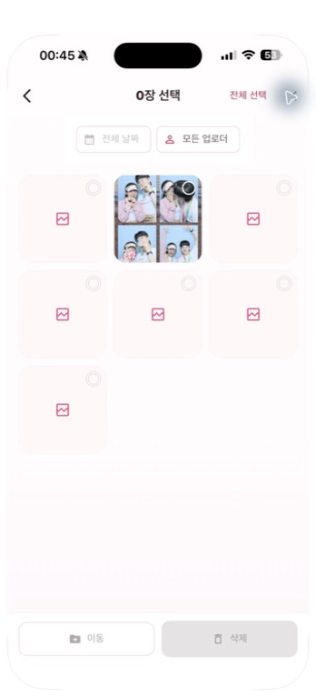

- 상태: 기본 구조는 좋지만 선택 컨트롤과 취소 경로가 약하다.
- 장점: 제목이 `0장 선택`으로 바뀌고, 이동/삭제를 하단 action bar에 고정해 선택 모드임을 알린다. 미선택 상태에서 파괴적 동작을 비활성화한 점도 안전하다.
- UX 위험: 우상단이 `전체 선택`만 있어 선택 모드를 취소하려면 뒤로가기를 추론해야 한다. 각 사진의 선택 원이 작고 테두리 대비가 매우 낮아 보인다. 실패한 사진까지 선택 대상인지, 선택 후 이동/삭제가 가능한지 맥락이 부족하다.
- 접근성 위험(화면 근거): 선택 원이 44pt보다 작아 보이며, checked 상태와 사진 정보가 스크린리더에 함께 제공돼야 한다. 삭제 버튼은 disabled semantics와 이유가 필요하다.
- 제안 초안: 헤더를 `취소 | N개 선택 | 전체 선택`으로 구성한다. 타일 전체를 선택 타깃으로 하고 우상단 체크는 최소 24pt 시각 크기/44pt hit area, 3:1 경계를 적용한다. 선택 후에는 destructive 색과 confirm 단계, 이동 대상 요약을 제공한다.
- 증거: `screenshots/13-photo-selection-mode.png`.

## Step 14 — 더보기 상단

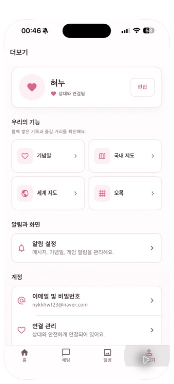

- 상태: 기능 구조는 명확하지만 프로필·기능 카드와 설정 목록의 시각 체계가 분리돼 보인다.
- 장점: 프로필, 우리 기능, 알림과 화면, 계정 순서가 사용자 기대에 맞다. 기념일/지도/오목의 2×2 바로가기도 찾기 쉽다.
- UX 위험: 프로필 기본 아바타가 단순 하트 원형이라 홈의 실제 프로필 사진/마스코트와 시각 언어가 다르다. 기능 카드 아이콘은 옅은 분홍 상자 안에 작게 들어가 구분력이 약하고 chevron이 반복돼 노이즈가 많다. 알림 설정 카드의 부제는 작은 저대비 텍스트다.
- 접근성 위험(화면 근거): 기능 제목과 아이콘만으로 국내/세계 지도 차이를 설명하며 색·작은 glyph 의존도가 높다. 카드/편집 버튼/행의 44pt 타깃과 VoiceOver 묶음 라벨을 확인해야 한다.
- 제안 초안: 프로필은 실제 이미지 또는 중립 이니셜 fallback으로 통일하고, 기능 바로가기는 2열 카드의 제목+짧은 상태(방문 N곳 등)로 가치가 보이게 한다. 반복 chevron은 semantics에서 제외하고 카드 전체만 포커스되게 한다.
- 증거: `screenshots/14-more-settings-top.png`.

## Step 15 — 계정/위험 작업

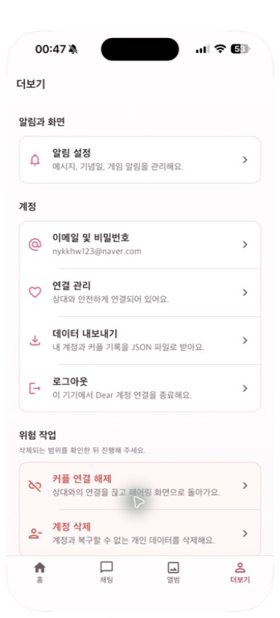

- 상태: 파괴적 동작을 분리한 점은 좋지만 일반 계정 작업과 위험 작업의 경계가 더 강해야 한다.
- 장점: 이메일/비밀번호, 연결 관리, 내보내기, 로그아웃을 한 그룹에 두고 `위험 작업`을 별도 섹션으로 분리했다. 위험 작업에 설명을 추가한 것도 적절하다.
- UX 위험: 로그아웃과 데이터 내보내기가 동일한 행 스타일로 연속돼 실수 가능성이 있고, `커플 연결 해제`와 `계정 삭제`는 화면 하단 탭바에 가깝다. 위험 작업 카드의 붉은 강조가 옅어 일반 행처럼 보인다. `데이터 내보내기`가 JSON이라고만 써 비개발자에게 결과·개인정보 범위가 불분명하다.
- 접근성 위험(화면 근거): 작은 회색 설명은 대비가 낮다. 위험 작업은 색만으로 구분하지 말고 제목/아이콘/확인 dialog 문구로 의미를 반복해야 한다.
- 제안 초안: `내 데이터 다운로드`로 사용자 언어를 쓰고 포함 범위·저장 위치를 설명한다. 로그아웃은 독립 섹션으로, 연결 해제/계정 삭제는 추가 간격·강한 테두리·명시적 경고문과 재인증/타이핑 확인을 사용한다. 스크롤 끝에는 탭바+safe area 인셋을 확보한다.
- 증거: `screenshots/15-more-settings-danger-zone.png`.

## Step 16 — 알림 설정 오류

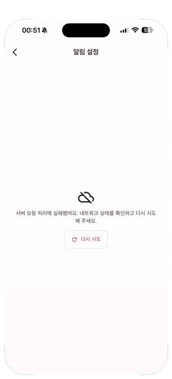

- 상태: 재시도는 가능하지만 설정을 전혀 볼 수 없어 장애 시 통제권을 잃는다.
- 장점: 뒤로가기, 제목, 오류 설명, 재시도만 남겨 상태가 단순하다.
- UX 위험: 서버 요청 실패 때문에 로컬에 저장된 알림 선호까지 모두 숨겨진다. `네트워크 상태를 확인` 문구는 서버 오류/토큰 등록 실패/설정 로드 실패를 구분하지 않는다. 시스템 알림 권한을 여는 경로도 없다.
- 접근성 위험(화면 근거): 상태 발생 자동 공지, 재시도 busy state, 설정 앱으로 가는 대체 CTA가 없다.
- 제안 초안: 마지막 저장값은 화면에 유지하고 상단 배너로 동기화 실패만 알린다. 권한 상태는 로컬에서 즉시 읽어 `허용됨/꺼짐`을 보여 주고 꺼짐이면 `설정 열기`를 제공한다. 서버 동기화 재시도는 행별/전체로 구분한다.
- 코드 추가 근거: 현재 iOS 권한을 로그인 직후 맥락 없이 요청하며 APNs/FCM을 최대 약 90초 폴링할 수 있다. 앱 내 사전 설명→사용자 탭→시스템 요청→결과별 복구로 분리해야 한다.
- 증거: `screenshots/16-notification-settings-error.png`.
